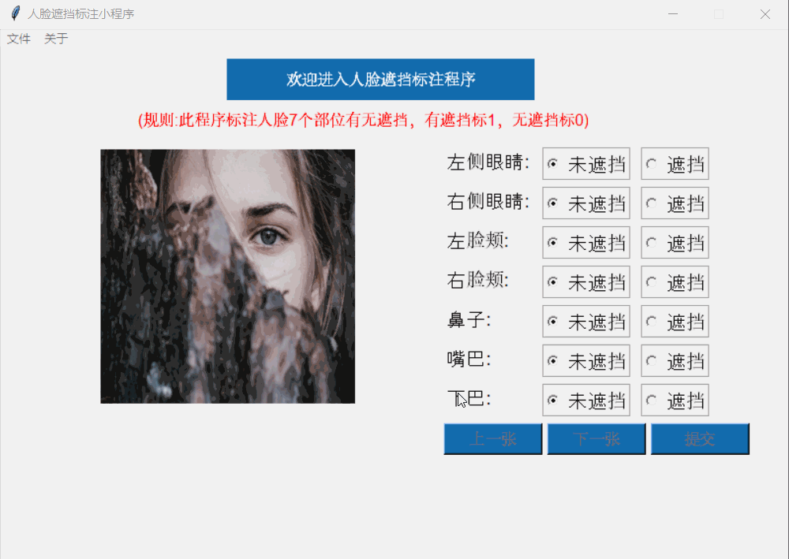
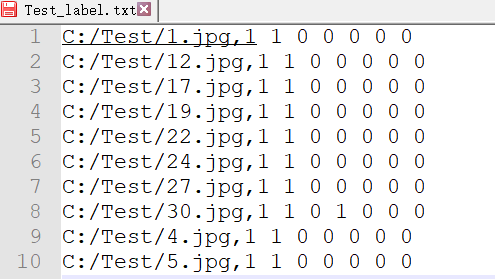

# face-occlusion-label-tools
简易的人脸五官有无遮挡标注小工具，simple  face occlusion label tools

 

### Requirements

* Ubuntu / macOS / Windows
* Python3
* pillow


### 界面介绍

 

* **菜单栏：文件，关于**
* **主界面**

**菜单栏—>文件—>打开: 选择图片文件夹**

**关于：包括版本号、作者**

**主界面**：**左侧为欢迎界面**，**右上角为标注有无遮挡的单选按钮**，之所以不用文本框是因为可以按钮可以单手操作。**右下角为三个按钮，上一张，下一张跟提交**。程序刚运行时，按钮都为灰色不可点击状态，防止误提交，只有选择了文件夹，三个按钮才生效。

**程序介绍**：此程序可以标注人脸7个部位有无遮挡，**有遮挡的部位值为1，无遮挡的部位值为0**，生成多标签分类模型所需的标签形式，标签顺序为 **[左眼，右眼，左脸颊，右脸颊，鼻子，嘴巴，下巴]**,例如：戴了墨镜的人脸，其左右眼都是遮挡的，这时候：标签即为 **[1,1,0,0,0,0,0]**。

### 程序运行

```shell
python face_label_v3.py
```

该程序可以选择文件夹，然后标注文件夹内的图片，生成一个图片跟标签对应的txt文件，运行过程如下图所示：

 

标注结果保存在选取的文件夹中：

 


